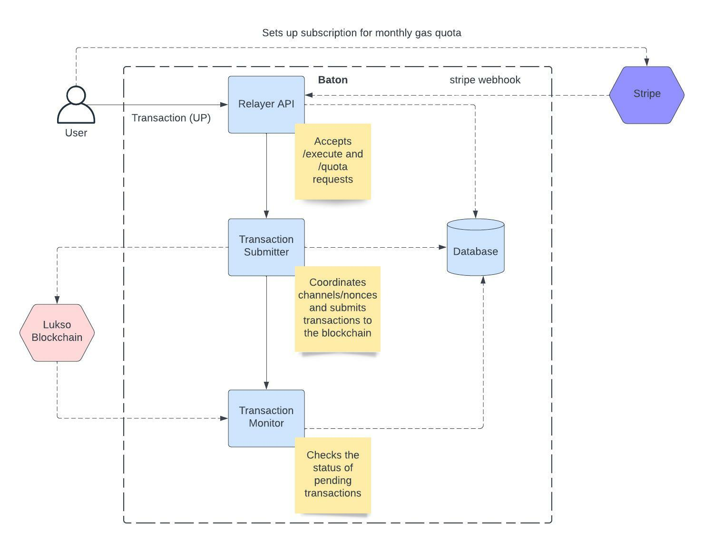

# Baton

A relayer that provides users with an easy onboarding experience to the lukso network by offering them gas free transactions. All universal profiles that sign up will be given a free monthly gas quota. If a user would like to increase this quota they may sign up for our basic or premium plan. They can do this by paying and managing their subscription via stripe, making it an easy and familiar experience for the user.

Front end repo: https://github.com/Rask467/lukso-relayer-frontend

Demo video: https://www.youtube.com/watch?v=BcXSmy5yROc

# Team

Developer: Rask467 - rask46777@gmail.com

# Project set up

Run `npm i` to install all dependencies.

Replace `example.env` with `.env` and fill in with values

Run `tsc` and `npm run dev` to start the server.

Dependencies:

1. Redis for job queues
2. Postgres db
3. Stripe
